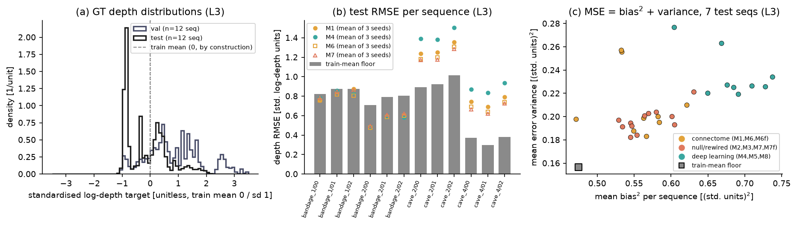
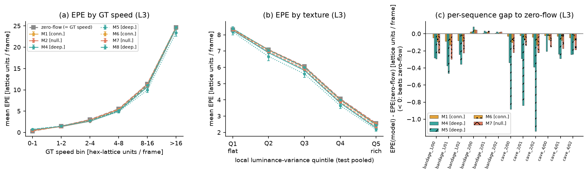
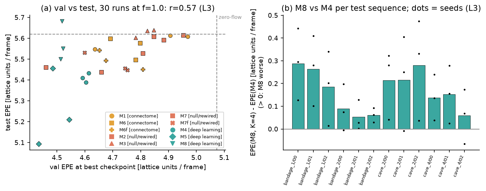
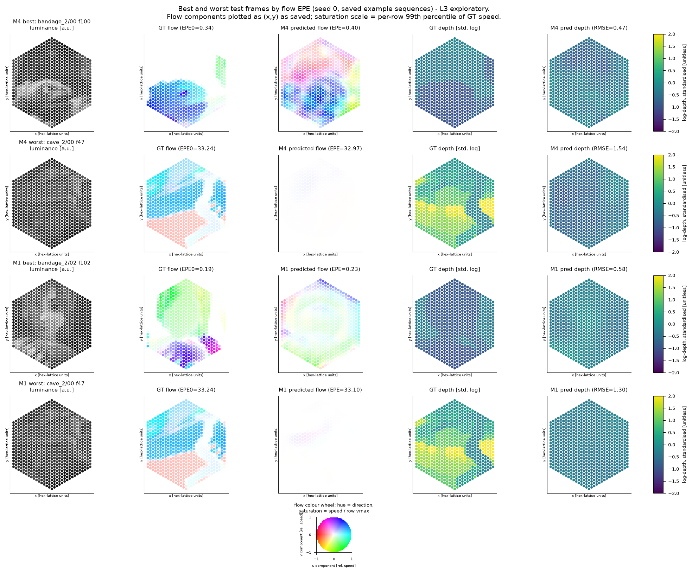

# Error analysis (pre-registered, PLAN/EVALUATION)

> ทุกตัวเลขในเอกสารนี้สร้างโดย `error_analysis.py` จาก output ที่บันทึกไว้แล้วเท่านั้น (`per_pixel.npz`, `examples.npz`, `metrics.json`, `val_log.jsonl`, `floors_out/`, `depth_norm.json`) ไม่มีการรัน `eval.py`/`floors.py` ซ้ำบน test. ตัวชี้วัดที่ลงทะเบียนไว้ล่วงหน้า (EPE, RMSE, margin เหนือ floor) ระบุว่า pre-registered; การแบ่ง bin, bias/variance, correlation และภาพทั้งหมดเป็น **L3 (exploratory)** ไม่ใช่หลักฐานยืนยัน. ตาราง CSV อยู่ที่ `results/error_analysis/`, ตัวเลขดิบทั้งหมดใน `error_analysis_numbers.json`.

หมายเหตุ: มี 39 runs ทั้งหมด แต่ที่ f=1.0 มี **30** runs (10 arm x 3 seed) ไม่ใช่ 33; ใช้ 30 runs สำหรับ Q1-Q3. ตรวจสอบแล้วว่าค่าเฉลี่ยจาก `per_pixel.npz` ตรงกับ `metrics.json` (ต่างสูงสุด 4.8e-06).

## 1. Depth: ทำไมไม่มีโมเดลชนะ train-mean floor บน test

ข้อเท็จจริง (pre-registered metric): floor RMSE test = **0.766**, โมเดล 0/39 runs ชนะ (ช่วง 0.817-1.356); บน val floor = 1.863 และโมเดลชนะ 30/30 runs (f=1.0, best checkpoint). คำนวณ floor ใหม่จาก `gt_depth` ได้ 0.7659 (test) และ 1.8632 (val) ตรงกับไฟล์ floors.

**(a) การกระจายของ log-depth ต่าง split มาก** (L3). train จาก `depth_norm.json` (ค่า clip แล้ว); val/test คำนวณจาก `gt_depth` (val จาก `m4_s0/val/per_pixel.npz`). target = (log depth - mean)/sd ของ train ดังนั้น train มี mean 0, sd 1 โดยนิยาม.

| split | log-depth mean | log-depth sd | target mean | target sd | median depth (Sintel units) | floor RMSE^2 = var + (mean-c)^2 |
|---|---|---|---|---|---|---|
| train | 1.139 | 1.816 | 0.000 | 1.000 | - | - |
| val | 3.467 | 2.482 | 1.282 | 1.367 | 24.03 | 1.868 + 1.603 |
| test | 0.872 | 1.359 | -0.147 | 0.748 | 1.76 | 0.560 + 0.026 |

val เป็นฉากไกล (market/mountain; target mean 1.282 เท่าของ sd train) ทำให้ train-mean floor แย่ (1.603 ของ MSE มาจาก offset ของ mean). test (bandage/cave) อยู่ใกล้ค่าเฉลี่ย train (target mean -0.147) floor จึงเกือบเป็น oracle แบบค่าคงที่: sd ภายในแต่ละ sequence เหลือเพียง 0.372 (RMSE ที่ได้ถ้าเดาค่าคงที่ที่ถูกต้องต่อ sequence). การเทียบกับ floor บน test จึงเป็นเกณฑ์ที่เข้มกว่า val มาก ไม่ใช่ว่าโมเดลแย่ลงเมื่อเทียบกับ val.

แยกตามฉาก (target units; floor RMSE ต่อฉาก):

| scene | split | target mean | target sd | floor RMSE |
|---|---|---|---|---|
| bandage_1 | test | -0.836 | 0.109 | 0.859 |
| bandage_2 | test | -0.702 | 0.279 | 0.770 |
| cave_2 | test | 0.724 | 0.625 | 0.944 |
| cave_4 | test | 0.226 | 0.282 | 0.352 |
| market_2 | val | 1.278 | 0.380 | 1.318 |
| market_5 | val | 0.069 | 0.569 | 0.571 |
| market_6 | val | 0.348 | 0.642 | 0.723 |
| mountain_1 | val | 3.241 | 0.541 | 3.271 |

**(b) RMSE รายsequence: floor เทียบกับโมเดล (mean 3 seed, L3)**

| sequence | floor | M1 | M4 | M5 | M6 | M7 |
|---|---|---|---|---|---|---|
| bandage_1/00 | 0.82 | 0.76 | 0.78 | 0.75 | 0.76 | 0.78 |
| bandage_1/01 | 0.88 | 0.84 | 0.86 | 0.77 | 0.82 | 0.85 |
| bandage_1/02 | 0.88 | 0.88 | 0.83 | 0.78 | 0.81 | 0.86 |
| bandage_2/00 | 0.71 | 0.48 | 0.49 | 0.50 | 0.48 | 0.49 |
| bandage_2/01 | 0.79 | 0.59 | 0.59 | 0.51 | 0.59 | 0.61 |
| bandage_2/02 | 0.81 | 0.60 | 0.58 | 0.47 | 0.60 | 0.62 |
| cave_2/00 | 0.89 | 1.24 | 1.39 | 1.37 | 1.18 | 1.17 |
| cave_2/01 | 0.92 | 1.25 | 1.38 | 1.41 | 1.20 | 1.18 |
| cave_2/02 | 1.02 | 1.35 | 1.50 | 1.53 | 1.31 | 1.28 |
| cave_4/00 | 0.37 | 0.74 | 0.87 | 0.86 | 0.69 | 0.67 |
| cave_4/01 | 0.30 | 0.69 | 0.84 | 0.84 | 0.64 | 0.62 |
| cave_4/02 | 0.38 | 0.79 | 0.94 | 0.96 | 0.74 | 0.73 |

จาก 360 คู่ (run x sequence) โมเดลชนะ floor 159 คู่; จำนวน run (จาก 30) ที่ชนะ floor ต่อ sequence = [27, 23, 19, 30, 30, 30, 0, 0, 0, 0, 0, 0]. โมเดลชนะได้เฉพาะ bandage (6 sequence แรก) และแพ้ cave ทุก run: cave_2 (ฉากไกลกว่า, target mean 0.724) โมเดล RMSE ~1.2-1.4 กับ floor ~0.9-1.0; cave_4 floor เพียง 0.37-0.38 (ใกล้ train-mean มาก) โมเดลแพ้ถึง 2 เท่า.

**(c) แยก MSE = bias^2 + variance ของ error** (L3). `per_pixel.npz` เก็บเฉพาะ sqerr ไม่มี sign จึงใช้ `examples.npz` (ทำนายจริง) แปลงกลับเป็นหน่วย target; ครอบคลุม 7 จาก 12 test sequences (bandage_1/00, bandage_2/00, bandage_2/01, bandage_2/02, cave_2/00, cave_2/02, cave_4/00) เท่านั้น และ 810 pixel ที่ไม่ finite (float16 overflow) ถูกตัดออก. ค่าเป็นค่าเฉลี่ยของตัวเลขรายsequence (ไม่ใช่ pooled RMSE) จึงไม่เท่าตัวเลข RMSE ใน (a)-(b) โดยตรง.

| กลุ่ม | MSE | bias^2 | variance | corr(pred,GT) ใน seq | slope pred~GT | sd ของ pred / sd ของ GT |
|---|---|---|---|---|---|---|
| floor (test, 7 seq) | 0.631 | 0.475 | 0.157 | - | 0 | 0 / 0.357 |
| โมเดล f=1.0 (30 runs, test) | 0.811 | 0.599 | 0.212 | -0.31 | -0.18 | 0.15 / 0.36 |
| val floor (3 seq) | 3.428 | 3.188 | 0.241 | - | 0 | - |
| โมเดล M1/M4/M6f s0 (val, 3 seq) | 2.213 | 1.943 | 0.270 | 0.33 | 0.25 | 0.32 / 0.47 |
| โมเดลชุดเดียวกัน (test, 7 seq) | 0.834 | - | - | -0.30 | -0.18 | 0.14 / 0.36 |

bias^2 คิดเป็น 66% ของ MSE ของโมเดล (mean ของสัดส่วนรายsequence); โมเดลทำนาย depth แทบเป็นค่าคงที่ (sd ของ pred ~0.15 เทียบกับ sd จริง 0.36) และ **ภายใน sequence ที่ test correlation ติดลบ (-0.31)** ขณะที่บน val เป็นบวก (0.33). ดังนั้นคำตอบคือ: (1) ส่วนใหญ่เป็น **calibration/level shift ของ split** (floor test ต่ำเพราะ test อยู่ใกล้ mean ของ train ไม่ใช่เพราะ floor ฉลาด); (2) โมเดลไม่ได้เรียน depth ภายใน sequence ที่ generalise ข้ามฉาก (correlation เปลี่ยนเครื่องหมาย val -> test) จึงได้ MSE สูงกว่าการเดาค่าคงที่ เพราะทั้ง bias^2 และ variance ของโมเดลสูงกว่า floor. สรุปนี้ L3 จากตัวอย่าง 7+3 sequence และ 3 runs บน val.

## 2. Flow: EPE ตามความเร็วและ texture (L3)

zero-flow EPE = ความเร็ว GT ของ pixel นั้นพอดี. bin ความเร็วกำหนดล่วงหน้าในสคริปต์ (หน่วย lattice units/frame), bin texture = quintile ของ luminance variance ท้องถิ่น (pooled test). ตัวเลข = mean ของ 3 seed.

ตาราง EPE ตามความเร็ว GT (ตัวหนา = ต่ำกว่า zero-flow):

| arm | 0-1 | 1-2 | 2-4 | 4-8 | 8-16 | >16 |
|---|---|---|---|---|---|---|
| pixel share | 28% | 11% | 21% | 20% | 10% | 10% |
| zero-flow | 0.33 | 1.49 | 3.02 | 5.53 | 11.38 | 24.68 |
| M1 | 0.42 | **1.43** | **2.91** | **5.44** | **11.30** | 24.69 |
| M2 | 0.43 | **1.48** | **2.95** | **5.44** | **11.29** | **24.68** |
| M4 | 0.64 | **1.37** | **2.63** | **5.02** | **10.67** | **24.40** |
| M5 | 0.77 | **1.46** | **2.61** | **4.87** | **9.95** | **23.44** |
| M6 | 0.55 | **1.44** | **2.82** | **5.30** | **11.11** | **24.62** |
| M7 | 0.59 | **1.36** | **2.69** | **5.16** | **10.93** | **24.52** |
| M8 | 0.72 | 1.49 | **2.77** | **5.18** | **11.08** | 24.69 |

ตาราง EPE ตาม texture:

| arm | Q1 flat | Q2 | Q3 | Q4 | Q5 rich |
|---|---|---|---|---|---|
| zero-flow | 8.33 | 7.09 | 6.06 | 4.07 | 2.56 |
| M1 | 8.36 | **7.07** | **6.02** | **4.01** | **2.49** |
| M2 | 8.35 | **7.08** | **6.03** | **4.04** | **2.53** |
| M4 | **8.26** | **6.90** | **5.81** | **3.81** | **2.27** |
| M5 | **8.17** | **6.67** | **5.60** | **3.64** | **2.19** |
| M6 | 8.34 | **7.05** | **5.99** | **3.97** | **2.45** |
| M7 | **8.31** | **6.97** | **5.88** | **3.87** | **2.34** |
| M8 | 8.39 | **7.05** | **5.99** | **4.00** | **2.45** |

สัดส่วน pixel ที่โมเดลมี EPE ต่ำกว่า zero-flow (ทุก pixel; bin 0-1 ... >16):

| arm | ทั้งหมด | 0-1 | 1-2 | 2-4 | 4-8 | 8-16 | >16 |
|---|---|---|---|---|---|---|---|
| M1 | 50.1% | 33% | 58% | 63% | 56% | 56% | 44% |
| M2 | 48.4% | 28% | 52% | 58% | 58% | 58% | 52% |
| M4 | 60.1% | 25% | 64% | 74% | 76% | 78% | 76% |
| M5 | 59.4% | 24% | 65% | 75% | 74% | 79% | 70% |
| M6 | 53.6% | 24% | 58% | 66% | 67% | 70% | 65% |
| M7 | 57.6% | 28% | 66% | 72% | 70% | 73% | 62% |
| M8 | 50.8% | 21% | 58% | 65% | 67% | 63% | 52% |

ข้อสังเกต: ในทุก bin ความแตกต่างจาก zero-flow เล็กมาก (M5 ดีสุด: bin 8-16 9.95 vs 11.38). pixel ที่ GT เคลื่อนที่ < 1 lattice unit/frame (bin 0-1) โมเดลแย่กว่า zero-flow เกือบทุก arm (M1 0.42, M5 0.77 vs 0.33) -- โมเดลใส่ flow สัญญาณรบกวนในบริเวณที่นิ่ง. ที่ความเร็วสูง (>16, 10% ของ pixel แต่คิดเป็น 44% ของ zero-flow EPE รวม) โมเดลได้เพียงเล็กน้อย. อัตราส่วน mean speed ของ pred ต่อ GT (บน example sequences): M1 0.05, M2 0.05, M4 0.16, M5 0.30, M6 0.08, M7 0.13, M8 0.14 -- โมเดลทุกตัวทำนายช้ากว่าจริงมาก (under-predict), M5 ใกล้จริงที่สุด; นี่คือเหตุที่ EPE ใกล้ zero-flow. texture: ยิ่งเรียบ ยิ่งผิด (zero-flow 8.33 ที่ Q1 เทียบ 2.56 ที่ Q5) แต่ความเร็วกับ texture อาจ confound กัน (ไม่ได้ควบคุม) จึงยืนยันบทบาทของ aperture problem ไม่ได้.

EPE รายsequence (mean 3 seed) เทียบ zero-flow:

| sequence | zero-flow | M1 | M4 | M5 | M6 | M7 | M5 - zero |
|---|---|---|---|---|---|---|---|
| bandage_1/00 | 2.18 | 2.13 | 1.89 | 1.88 | 2.09 | 1.95 | -0.29 |
| bandage_1/01 | 2.52 | 2.43 | 2.14 | 2.05 | 2.39 | 2.22 | -0.46 |
| bandage_1/02 | 2.10 | 2.02 | 1.86 | 1.74 | 2.01 | 1.88 | -0.36 |
| bandage_2/00 | 1.02 | 1.04 | 1.05 | 1.10 | 1.07 | 1.07 | 0.08 |
| bandage_2/01 | 0.92 | 0.93 | 0.95 | 0.94 | 0.94 | 0.95 | 0.02 |
| bandage_2/02 | 0.77 | 0.78 | 0.79 | 0.78 | 0.79 | 0.79 | 0.01 |
| cave_2/00 | 14.15 | 14.12 | 13.81 | 13.27 | 14.05 | 13.93 | -0.88 |
| cave_2/01 | 12.93 | 12.91 | 12.64 | 12.09 | 12.86 | 12.79 | -0.84 |
| cave_2/02 | 13.51 | 13.47 | 13.12 | 12.37 | 13.38 | 13.29 | -1.14 |
| cave_4/00 | 5.99 | 5.96 | 5.78 | 5.97 | 5.91 | 5.83 | -0.02 |
| cave_4/01 | 5.86 | 5.83 | 5.62 | 5.56 | 5.78 | 5.69 | -0.29 |
| cave_4/02 | 5.51 | 5.46 | 5.27 | 5.27 | 5.43 | 5.32 | -0.24 |

**M5 vs LK**: ไม่มี per-pixel/per-sequence ของ LK ที่บันทึกไว้ (floors เก็บแค่ค่ารวม EPE LK = 5.337) จึงบอกไม่ได้ว่า sequence ไหนทำให้ M5 (5.253, mean 3 seed; seed = 5.455, 5.093, 5.211) ชนะ LK; ทำได้เพียงเทียบกับ zero-flow: M5 ชนะ zero-flow ในทั้ง 3 seed ใน 8/12 sequences. ส่วนแบ่งของ gain รวม (EPE ลดลงเทียบ zero-flow, เฉลี่ยต่อ sequence) มาจาก cave_2 รวม 65% และ bandage_1 25%, bandage_2 -3%, cave_4 12% (ค่าลบ = ไม่ชนะ). ความแปรปรวนข้าม seed ของ M5 สูง (sd 0.18) -- seed 1 (5.093) ทำให้ mean ดี. (L3; M5 vs LK เป็นการเทียบ mean 3 seed กับค่าเดียว ไม่มี test ทางสถิติ)

## 3. ความไม่สอดคล้อง val-test (L3)

EPE ของ checkpoint ที่ val loss ต่ำสุด (`val_log.jsonl`) vs test EPE, 30 runs f=1.0: Pearson r = **0.57**, Spearman = 0.57. ระดับ arm (10 arm, mean 3 seed): r = 0.73, Spearman 0.78. **ภายใน arm** (ลบ mean ของ arm ออก, ดูเฉพาะความต่างระหว่าง seed): r = 0.09, Spearman -0.01 -- val ไม่ทำนาย seed ไหนจะดีบน test. (depth RMSE: r = -0.16, ไม่สัมพันธ์.)

ช่วงค่า: val EPE 4.434-4.968 (zero-flow 5.074, LK 4.709); test EPE 5.093-5.682 (zero-flow 5.620, LK 5.337). ชนะ zero-flow: val 30/30, test 27/30; ชนะ LK: val 16/30, test **2**/30. margin เฉลี่ยเหนือ zero-flow: val 0.377, test 0.113 (หดลงราว 3 เท่า). ลำดับ arm ยังพอเหมือนกัน (M5/M4 ดี, M1/M2/M3 แย่) แต่ขนาดผลต่างหายไป: เป็นสัญญาณว่า val (4 ฉาก) เป็นตัวแทนของ test (4 ฉากอื่น) ได้ไม่ดี และการเลือก checkpoint บน val ไม่ได้ช่วย test ในระดับ seed.

**M8 (K=4) vs M4 ต่อ test sequence (จับคู่ seed):** M8 แย่กว่า M4 เฉลี่ย +0.167 EPE; แย่กว่าในทั้ง 3 seed ใน 9/12 sequences, ดีกว่าทั้ง 3 seed ใน 0/12. ต่างมากสุดที่ bandage_1/00 (+0.29) และ cave_2/02 (+0.28); น้อยสุดที่ bandage_2/01 (+0.05). แต่บน val M8 (4.518) ดีกว่า M4 (4.603) -- ทิศทางกลับด้านระหว่าง val และ test (สอดคล้อง H6 NOT SUPPORTED).

## 4. Recurrent depth any-time curve ของ M8 (L3)

| K | test EPE mean | sd (3 seed) | seed 0 | seed 1 | seed 2 |
|---|---|---|---|---|---|
| 1 | 5.769 | 0.084 | 5.866 | 5.732 | 5.710 |
| 2 | 5.621 | 0.080 | 5.713 | 5.577 | 5.573 |
| 3 | 5.586 | 0.088 | 5.686 | 5.521 | 5.553 |
| 4 | 5.578 | 0.094 | 5.682 | 5.500 | 5.551 |

EPE ลดลงเมื่อ K เพิ่ม (5.769 -> 5.578; paired ลดลง 0.184, 0.232, 0.159 ใน 3 seed, ทิศทางเดียวกันทั้งหมด) แต่ ผลตอบแทนลดลงเร็ว: K=1->2 ลด 0.148, 3->4 ลดเพียง 0.009 (น้อยกว่า sd ข้าม seed 0.094). ทุก K ยังแย่กว่า M4 (5.411); K ที่ mean EPE ต่ำกว่า zero-flow (5.620) คือ [3, 4] (K=1: 5.769, K=2: 5.621). K=4 ตรงกับ `test/metrics.json` (ตรวจแล้ว). (ไม่มี val_k* ครบทุก seed จึงไม่เทียบ val)

## 5. ตัวอย่างเชิงคุณภาพ (L3)

เลือกเฟรมที่ EPE ต่ำสุด/สูงสุดจาก 7 example sequences ที่บันทึกไว้ (seed 0 ของ M4 และ M1) พิกัด hex จาก `flyvis.utils.hex_utils.get_hex_coords(15)` -> `hex_to_pixel`; สี flow: hue = ทิศ, saturation = ความเร็ว.

| model | kind | sequence/frame | EPE | zero-flow EPE (=GT speed) | depth RMSE (target units) |
|---|---|---|---|---|---|
| M4 | best | bandage_2/00 f100 | 0.40 | 0.34 | 0.47 |
| M4 | worst | cave_2/00 f47 | 32.97 | 33.24 | 1.54 |
| M1 | best | bandage_2/02 f102 | 0.23 | 0.19 | 0.58 |
| M1 | worst | cave_2/00 f47 | 33.10 | 33.24 | 1.30 |

การเลือกด้วย EPE สัมบูรณ์ถูกกำหนดโดยความเร็วของฉาก: 'best' คือเฟรมเกือบนิ่ง (EPE ~ GT speed เล็ก และแย่กว่า zero-flow เล็กน้อย) ส่วน 'worst' คือ cave_2/00 f47 ที่ GT speed ~33 และโมเดลทำนายแทบเป็นศูนย์ (EPE ~ speed). flow ที่ทำนายใน worst frame แทบไม่มีสี (speed ต่ำ) ส่วน depth ที่ทำนายเป็นสีเดียวกันทั้งภาพ (ค่าคงที่) ขณะ GT มีโครงสร้างชัด -- ภาพสอดคล้องกับ Q1 และ Q2.

## ข้อจำกัดและบทเรียน

- test มีแค่ 4 ฉาก (2 ตระกูล) 12 sequences ที่ขึ้นกับฉากสูง; sequences จากฉากเดียวกัน (split 00-02) ไม่อิสระกัน ตัวเลขรายsequence จึงไม่ใช่ n=12 อิสระ. ไม่มี CI/ทดสอบนัยสำคัญใน error analysis นี้.
- ทุกการแยก (bin, bias/variance, correlation) เป็น L3: ทำหลังเห็นผล test (แม้ pre-registered ให้ทำ error analysis) และไม่ผ่านการแก้ multiple comparisons; ใช้เป็นคำอธิบาย ไม่ใช่การยืนยัน.
- bias/variance ของ depth คำนวณได้เฉพาะ 7/12 test sequences (และ 3 runs / 3 sequences บน val) เพราะ `per_pixel.npz` ไม่เก็บ error แบบมีเครื่องหมาย; ค่านี้เป็นค่าเฉลี่ยรายsequence ไม่ใช่ RMSE ของทั้ง split.
- ไม่มี per-pixel ของ Lucas-Kanade (floors เก็บเฉพาะค่ารวม) จึงตอบ 'sequence ไหนทำให้ M5 ชนะ LK' ไม่ได้; ใช้ zero-flow เป็นตัวแทนเท่านั้น. val per_pixel มีเพียง 3 runs จึงเทียบ val กับ test ได้จำกัด.
- val 4 ฉากและ test 4 ฉากต่างกันมากด้านระยะลึก: ผล 'ทุกโมเดลชนะ floor บน val' ส่วนหนึ่งเกิดจาก floor บน val ที่ไม่เหมาะสม (ฉากไกลกว่า train) ไม่ใช่ความสามารถของโมเดล. บทเรียน: ควรรายงาน floor แบบจับคู่ฉาก/ต่อ-sequence mean และเลือก val จากฉากที่กระจายใกล้ test; ควรมีการ stratify split ตามระยะลึก.
- โมเดลทุกตัวทำนาย flow ช้ากว่าจริงและ depth เกือบคงที่: ผลโดยรวมใกล้ floor ที่ไม่เรียนรู้ ข้อสรุปเชิงชีววิทยา (connectome vs null) จึงอ่านจาก margin เล็กน้อยเหนือ floor ซึ่งเสี่ยงต่อ noise. การเทรนสั้นกว่าเปเปอร์ต้นฉบับและข้อมูลน้อย (674 เฟรม) เป็นข้อจำกัดหลัก.
- ข้อควรระวังเชิงเทคนิค: ทิศ flow ในภาพใช้ช่อง (u,v) ตามที่บันทึกเป็น (x,y) ตรง ๆ (ใช้แบบเดียวกันทั้ง GT/pred จึงเทียบกันได้ แต่ไม่ยืนยันการหมุนแกนของ lattice); float16 ใน per_pixel ทำให้เกิดความคลาดเคลื่อนเล็กน้อย (ตรวจกับ metrics.json แล้ว).
