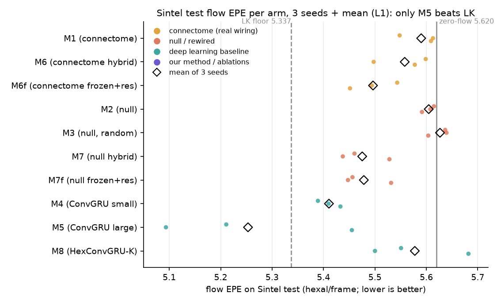
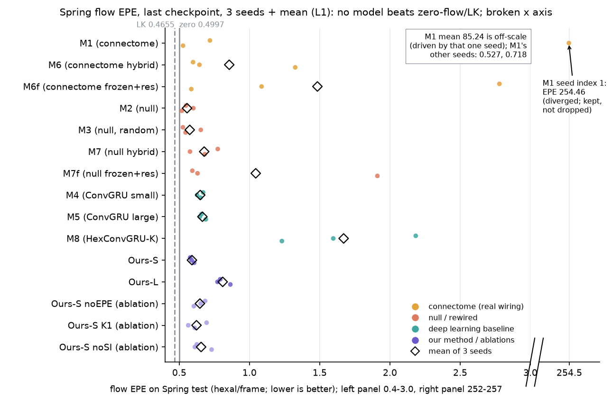
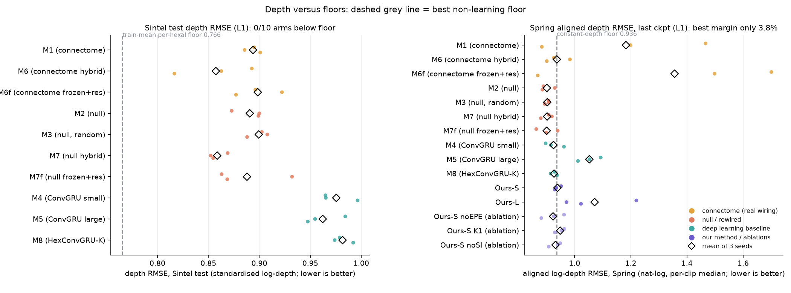
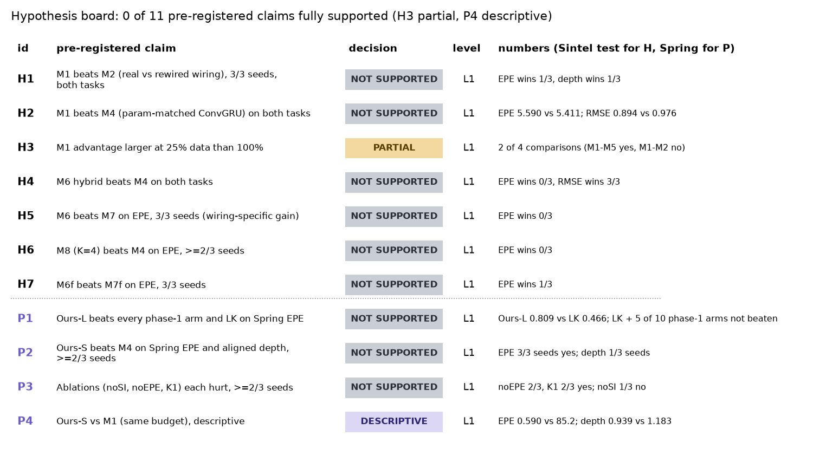
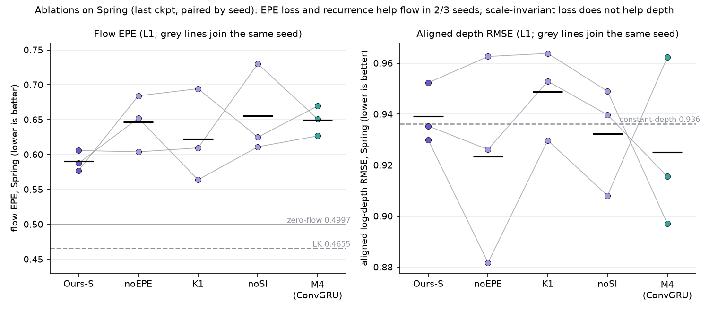
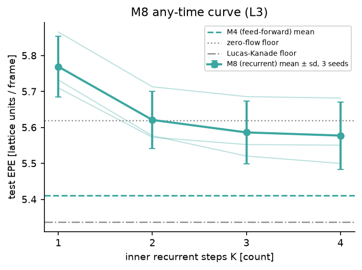
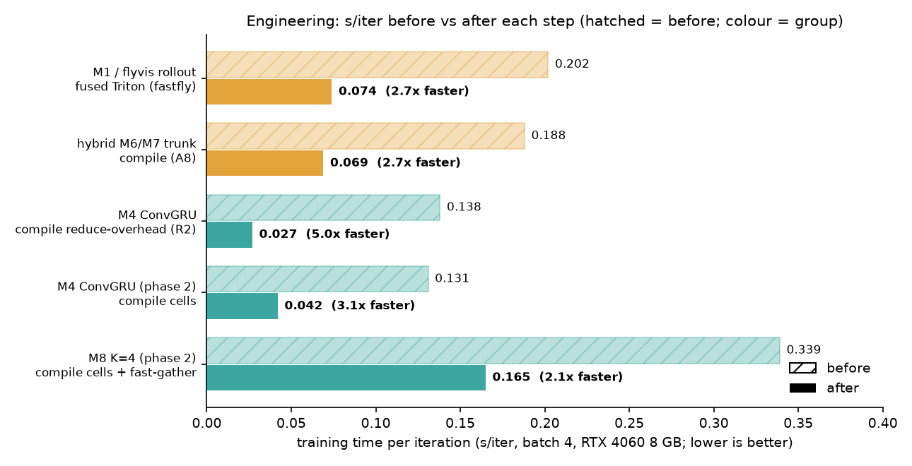

# รายงานผลรวมฉบับสุดท้าย: สมองแมลงหวี่ (connectome) vs deep learning vs วิธีของเรา

> สร้างจากผลที่มีอยู่แล้วเท่านั้น (ไม่รันโมเดลใหม่) ตัวเลขทุกตัวอ้างไฟล์ต้นทางในบรรทัด "แหล่ง". รูปสร้างโดย `make_summary_figs.py`
> (อ่านจาก `results/summary.csv`, `results/summary_p2.csv`). ป้ายระดับหลักฐาน: **L1** = ลงทะเบียนล่วงหน้า + test, **L2** = ลงทะเบียนแต่ val/ดูซ้ำ, **L3** = สำรวจ.
> สี: connectome จริง (M1, M6, M6f) = **amber**; null/rewired (M2, M3, M7, M7f) = **coral**; deep learning (M4, M5, M8) = **teal**; วิธีของเรา + ablation = **violet**; floors = **เทา**.

## 1) โจทย์และเหตุผล
ทำนาย **optic flow** และ **depth** ของทุกจุดพร้อมกัน (multi-task video) จากวิดีโอ 19 เฟรมที่ผ่าน "ตาแมลงหวี่" 721 hexal. คำถามหลัก: wiring จริงของ connectome
เป็น prior ที่ดีกว่า wiring สลับ/สุ่ม และกว่า deep learning ขนาดเท่ากันหรือไม่ แล้ว **วิธีของเรา** (recurrent depth + EPE loss + scale-invariant depth loss + init-normalised task weights) ทำได้ดีแค่ไหน.
ผลสรุปสั้น: งานยากมาก (มีแค่ M5 ชนะ Lucas–Kanade บน Sintel; บน Spring ไม่มีโมเดลชนะ floor ด้าน flow), wiring จริงไม่ดีกว่า null (L1), Ours-S ดีสุดในกลุ่ม deep learning ขนาดเท่ากันบน Spring flow แต่ไม่ชนะ floor (L1).
แหล่ง: `docs/NARRATIVE.md`, `PLAN.md`.

## 2) ข้อมูลและการแบ่ง
- **Sintel** (final pass + flow + depth, 23 ฉาก, Butler et al. 2012) render ลง hex lattice ด้วย flyvis. **แบ่งตามตระกูลฉาก** (seed 20261005) ไม่ให้ภาพคล้ายกันรั่วข้ามชุด:
  train = alley/ambush/bamboo/shaman/sleeping/temple (15 ฉาก, 674 เฟรม); val = market/mountain (4 ฉาก, 190 เฟรม); **test = bandage/cave (4 ฉาก, 200 เฟรม)**. แหล่ง: `docs/DATA.md`.
- **Spring** (Mehl et al. CVPR 2023, CC BY 4.0) = test ใหม่ต่างโดเมนสำหรับ phase 2: **8 sequence เลือกด้วย seed 20261010 ก่อนดูเนื้อหา** (`spring_sequences.json`) ประเมินครั้งเดียวกับทุก run.
  กฎเลือก checkpoint: **ใช้ checkpoint สุดท้าย (30k iter) ของทุก run เป็นตัวหลัก** เพราะ val ไม่ทำนาย test (ดู 4) ส่วน best.pt รายงานเป็นรอง (L2). แหล่ง: `PLAN.md` A9.
- เทรนทุกโมเดลบน train 15 ฉากเดิม, 30k iter, lr 5e-4, batch 4, 3 seed.

## 3) แบบจำลองทั้งหมด
| id | กลุ่ม/สี | พารามิเตอร์ | ไอเดีย | อ้างอิง |
|---|---|---|---|---|
| M1 | connectome / amber | 15,387 (734 + decoder 14,653) | flyvis wiring จริง เรียนจากศูนย์ | Lappalainen et al. 2024 |
| M2 | null / coral | 15,387 | สลับสาย degree-preserving | Maslov & Sneppen 2002 |
| M3 | null / coral | 15,387 | กราฟสุ่ม ER ชนิดเซลล์ | " |
| M4 | DL / teal | 15,402 | HexConvGRU ขนาดเท่า M1 | baseline มาตรฐาน (MODELS.md) |
| M5 | DL / teal | 604,835 | HexConvGRU ใหญ่ | " |
| M6 / M7 | amber / coral | 15,423 | front-end connectome จริง / rewired + HexConvGRU | PLAN A5 |
| M6f / M7f | amber / coral | 14,689 (train ได้) | front-end M1/M2 แช่แข็ง + residual zero-init | Zhang et al. ICCV 2023; Johannink et al. ICRA 2019 |
| M8 | DL / teal | 15,402 | HexConvGRU-K วน GRU K=1..4 (weight-tied) | Dehghani et al. ICLR 2019; Geiping et al. 2025 |
| **Ours-S** | ours / violet | 15,402 | M8 + EPE loss + SI depth loss + init-normalised weights | Eigen et al. NeurIPS 2014 (SI loss) |
| **Ours-L** | ours / violet | 274,323 | เหมือน Ours-S ขนาดใหญ่ (m9m) | " |
| noEPE / K1 / noSI | ablation / violet อ่อน | 15,402 | ถอด EPE loss / K_max=1 / SI loss ทีละอย่าง | PLAN A9 |
| floors | เทา | – | zero-flow, train-mean, Lucas–Kanade (hex), constant depth; ORACLE constant-velocity (ไม่ใช่คู่แข่ง) | Lucas & Kanade 1981 |
แหล่ง: `README.md`, `docs/MODELS.md`, `PLAN.md` A5, A6, A9.

## 4) Protocol
- **Pre-registration A1–A9** ก่อนรัน: A1 M4 param-matched รวม decoder; A2/A4 probe ว่า flow เรียนได้ (ผ่าน: val EPE M4 4.501 vs zero-flow 5.074); A5 hybrid M6/M7 (H4,H5);
  A6 claim ladder L1–L3 + floors + M6f/M7f (H7) + M8 (H6) + diagnostics; A7 grid 39 รอบ lr 5e-4 30k iter; A8 compile ของ hybrid (speed เท่านั้น); **A9 phase 2** (Ours-S/L, ablation, Spring, P1–P4).
- **Floors** รายงานคู่โมเดลทุกครั้ง: Sintel test zero-flow 5.620, LK 5.337, depth train-mean per-hexal 0.7657; Spring zero-flow 0.4997, LK 0.4655, constant-depth (aligned) 0.9362.
- **Test ใช้ครั้งเดียว ×2 ชุด**: Sintel test (phase 1) และ Spring (phase 2); Sintel test ถูกใช้หมดแล้ว (arm phase 2 บน Sintel เป็น "ดูซ้ำ" L2 เท่านั้น).
- **last vs best ckpt**: phase 1 ใช้ best.pt (เลือกบน val); phase 2 ใช้ last เป็นหลักเพราะ val ไม่สะท้อน test (ภายในโมเดลเดียวกัน r = 0.09; ชนะ LK บน val 16/30 run แต่ test เพียง 2/30).
  แหล่ง: `PLAN.md`, `docs/RESULTS.md`, `docs/ERROR_ANALYSIS.md` ข้อ 3.

## 5) ผล phase 1: Sintel test (L1, mean ± sd 3 seed)

| arm | flow EPE | depth RMSE |
|---|---|---|
| M1 (connectome) | 5.590 ± 0.036 | 0.894 ± 0.008 |
| M2 (null) | 5.605 ± 0.012 | 0.891 ± 0.015 |
| M3 (null) | 5.627 ± 0.020 | 0.899 ± 0.010 |
| M4 | 5.411 ± 0.022 | 0.976 ± 0.018 |
| M5 | **5.253 ± 0.185** | 0.962 ± 0.020 |
| M6 / M7 | 5.558 ± 0.053 / 5.475 ± 0.047 | 0.857 ± 0.038 / 0.859 ± 0.009 |
| M6f / M7f | 5.496 ± 0.046 / 5.478 ± 0.046 | 0.899 ± 0.023 / 0.888 ± 0.038 |
| M8 (K=4) | 5.578 ± 0.094 | 0.982 ± 0.009 |
| floors | zero 5.620, LK 5.337 | train-mean per-hexal 0.7657 |
- **ผลเด่น**: เฉพาะ M5 (mean 5.253) ต่ำกว่า LK 5.337; **depth: 0 จาก 39 run ชนะ floor** (ช่วง 0.817–1.356).
- M8 any-time: K1 5.769 → K2 5.621 → K3 5.586 → K4 5.578 (ลดลงทั้ง 3 seed) แต่ทุก K แย่กว่า M4 5.411.
- ผลของ front-end vs residual (M6f/M7f): final ดีกว่า front-end-only บน flow (M6f 5.590→5.496; M7f 5.605→5.478).
แหล่ง: `docs/RESULTS.md` (ตาราง per-arm, floors, any-time), `results/summary.csv`.

## 6) ผล phase 2: Spring (L1, last ckpt)

**M1 seed index 1 ระเบิด (EPE 254.46)**: แสดงด้วยแกนขาด + annotation ไม่ตัดทิ้ง; mean M1 = 85.24 ± 146.56 จึงอ่านไม่ได้ (seed อื่น 0.527, 0.718); ยืนยันก่อนหน้าว่าไม่ใช่บั๊ก kernel (NARRATIVE).
| arm | flow EPE | aligned depth RMSE |
|---|---|---|
| M2 (null) / M3 (null) | **0.555 ± 0.042** / 0.574 ± 0.069 | 0.901 / 0.903 |
| **Ours-S** | **0.590 ± 0.015** | 0.939 ± 0.012 |
| M4 / M5 | 0.649 ± 0.022 / 0.665 ± 0.022 | 0.925 / 1.053 |
| M7 / M6 | 0.677 ± 0.099 / 0.856 ± 0.408 | 0.902 / 0.937 |
| **Ours-L** | 0.809 ± 0.048 | 1.071 ± 0.131 |
| M8 (K=4) | 1.670 ± 0.481 | 0.927 |
| floors | zero 0.4997, **LK 0.4655** | constant 0.9362 |
- **ไม่มีโมเดลชนะ zero-flow/LK** ด้าน flow. ในกลุ่มที่เรียนรู้ null M2/M3 ดีที่สุด (0.555/0.574), ตามด้วย Ours-S 0.590, ซึ่ง **ชนะ M4 ครบ 3/3 seed** (0.590 vs 0.649).
- Ours-S ไม่ชนะ M2/M3 บน flow. Ours-L ใหญ่แต่แย่กว่า Ours-S (0.809): ขนาดไม่ช่วย.

- **Depth**: Sintel test ไม่มี arm ใดชนะ floor; Spring aligned มีเพียงบาง arm ชนะ floor 0.9362 เล็กน้อย (M2 3.7%, M3 3.6%, M7 3.6%, M7f 3.8%, M4 1.2%) ส่วน Ours-S 0.939 ไม่ชนะ (−0.3%).
- Any-time Ours-S: K1 0.580 → K4 0.590 (flat/ไม่ดีขึ้นบน Spring, L2); M8 แย่ลงตาม K (0.893 → 1.670): recurrent depth ไม่ได้ช่วยข้ามโดเมนเสมอ.
- Sintel test "ดูซ้ำ" (L2): Ours-L 5.557, Ours-S 5.661 (ยังแย่กว่า M4 5.411).
- best.pt บน Spring (L2): Ours-S 0.536 ± 0.030 ดีที่สุดใน flow; M2 0.533 ± 0.008 ใกล้เคียงกัน (ตาราง Secondary ใน RESULTS_P2).
แหล่ง: `docs/RESULTS_P2.md`, `results/summary_p2.csv`.

## 7) Hypothesis board

- **H1, H2, H4, H5, H6, H7 ไม่ผ่าน, H3 ผ่านบางส่วน (2/4), P1, P2, P3 ไม่ผ่าน, P4 บรรยาย (ทั้งหมด L1)** → ไม่มีข้อไหนผ่านเต็ม.
- รายละเอียด: H1 EPE ชนะ 1/3 & depth 1/3; H2 EPE 5.590 vs 5.411; H4 EPE 0/3 แต่ RMSE 3/3 (0.857 vs 0.976); H5 0/3; H6 0/3; H7 1/3.
- P2: EPE ชนะ 3/3 แต่ aligned depth ชนะ 1/3 → ไม่ผ่านตามเกณฑ์ทั้งสองงาน. P3: noEPE และ K1 แย่กว่า Ours-S ใน 2/3 seed (ผ่าน) แต่ noSI แย่กว่าเพียง 1/3 (ไม่ผ่าน).
- P4: Ours-S 0.590 vs M1 85.24 (ต่ำกว่า 2/3 seed); depth 0.939 vs 1.183.

แหล่ง: `docs/RESULTS.md` (H1–H7), `docs/RESULTS_P2.md` (P1–P4).

## 8) Error analysis highlights
เอกสาร: [Sintel test](ERROR_ANALYSIS.md) และ [Spring](ERROR_ANALYSIS_SPRING.md) (ทั้งหมด L3 สำรวจ).
- **Depth Sintel**: floor test ต่ำเพราะ test ใกล้ mean ของ train (ไม่ใช่ floor ฉลาด); 66% ของ MSE เป็น bias^2; โมเดลทำนายเกือบคงที่ (sd pred 0.15 vs 0.36) และ correlation ภายใน sequence ติดลบ (−0.31) บน test; ชนะ floor เฉพาะ bandage, แพ้ cave ทุก run.
- **Flow Sintel**: ต่างจาก zero-flow น้อยมากทุก bin; ที่ GT ช้า (<1 unit) โมเดลแย่กว่า zero-flow; ความเร็ว >16 (10% ของ pixel, 44% ของ error) แทบไม่ได้อะไร; gain ของ M5 มาจาก cave_2 65%.
- **val ไม่สะท้อน test**: r ภายในโมเดล 0.09; margin เหนือ zero-flow หดจาก 0.377 (val) เหลือ 0.113 (test).
- **M8 K**: ดีขึ้นตาม K แต่ ผลตอบแทนลดเร็ว (K3→4 ลด 0.009 < sd ข้าม seed 0.094).
- ผล Spring และ outlier ของ M1 ดู ERROR_ANALYSIS_SPRING.md (ไม่คัดลอกตัวเลขมาที่นี่).

แหล่ง: `docs/ERROR_ANALYSIS.md` ข้อ 1–4.

## 9) Engineering

- flyvis M1: **fused Triton rollout (fastfly)** 0.202 → 0.074 s/iter (2.7× เทียบ baseline เดิม; 2.40× เทียบ fused penalty 0.177; VRAM 1.39→0.48 GB; parity ~1e-7). แหล่ง: `docs/R2_BENCHMARK.md`.
- M4: `torch.compile` reduce-overhead 0.138 → 0.027 (5.0×, R2); phase 2 `--compile cells`: 0.131 → 0.042 (3.1×). M8 K=4: 0.339 → 0.165 (2.1×, cells + fast-gather). hybrid: 0.188 → 0.069 (A8, PLAN).
  (ตัวเลข phase 2 มาจากผลวัดความเร็วของ phase 2 ที่ส่งมาพร้อมงานนี้ ไม่ได้อยู่ใน R2_BENCHMARK.md)
- Mixed precision/TF32 ไม่ช่วย (≤4%). รวม **54 training runs** (39 + 15) บน RTX 4060 8 GB. แหล่ง: `docs/NARRATIVE.md`.

## 10) สิ่งที่เรียนรู้ / ข้อจำกัด / งานต่อ
**เรียนรู้**
1. Pre-registration + floors + null + test ครั้งเดียว ทำให้เชื่อผลได้ และจับข้อสรุปผิดได้ (เช่น "ทุกโมเดลชนะ floor บน val" แต่ test 0/39 ด้าน depth).
2. wiring จริงของ connectome ไม่ได้ให้ประโยชน์เหนือ null (H1, H5, H7 ไม่ผ่าน); ข้ามโดเมนยังพบ M1 ไม่เสถียร (seed ระเบิด).
3. ส่วนผสมของเราช่วย flow ในกลุ่มขนาดเท่ากัน (EPE loss, recurrence 2/3 seed) แต่ SI depth loss ไม่ช่วย และไม่ชนะ floors.
**ข้อจำกัด**: test Sintel มีแค่ 4 ฉาก (2 ตระกูล) sequence จากฉากเดียวกันไม่อิสระ; ข้อมูลเทรนน้อย (674 เฟรม), ไม่ปรับ lr ต่อ arm; 3 seed ต่อ arm (sd บางตัวใหญ่ เช่น M6 Spring ±0.41);
primary checkpoint ที่เปลี่ยนจาก best เป็น last ระหว่าง phase ทำให้ตัวเลขสองชุดเทียบตรง ๆ ไม่ได้; ไม่มี per-pixel ของ LK; error analysis ทั้งหมดเป็น L3; Spring ถูกใช้หมดแล้ว.
**งานต่อ**: stratify split ตามระยะลึก, เทรนนานขึ้น/ข้อมูลมากขึ้น พร้อม early stop จากหลาย val, ปรับ lr ต่อ arm, ตรวจสาเหตุ M1 ไม่เสถียรบน Spring, ทดสอบ depth head ที่ calibrate ข้ามโดเมน.
**ที่เหลือ**: slides และซ้อมพรีเซนต์ (ดู `docs/STATUS.md`).

## 11) อ้างอิง (เฉพาะที่อ้างใน repo แล้ว)
- Butler et al., ECCV 2012 (MPI Sintel). Mehl et al., CVPR 2023 (Spring).
- Lappalainen et al., Nature 2024 (flyvis). Dorkenwald et al., Nature 2024 (FlyWire connectome).
- Maslov & Sneppen, Science 2002 (degree-preserving rewiring). Lucas & Kanade, IJCAI 1981.
- Dehghani et al., ICLR 2019 (Universal Transformers). Geiping et al., arXiv:2502.05171, 2025 (recurrent depth). Eigen et al., NeurIPS 2014 (scale-invariant depth loss).
- Zhang, Rao & Agrawala, ICCV 2023 (ControlNet). Johannink et al., ICRA 2019 (residual RL). Kornblith et al., ICML 2019 (CKA). Nosek et al., PNAS 2018 (preregistration).
แหล่ง: `PLAN.md` A6/A9, `README.md`.

## ตารางเอกสารที่เกี่ยวข้อง
[NARRATIVE](NARRATIVE.md) · [RESULTS](RESULTS.md) · [RESULTS_P2](RESULTS_P2.md) · [ERROR_ANALYSIS](ERROR_ANALYSIS.md) · [ERROR_ANALYSIS_SPRING](ERROR_ANALYSIS_SPRING.md) · [R2_BENCHMARK](R2_BENCHMARK.md) · [PLAN](../PLAN.md)
